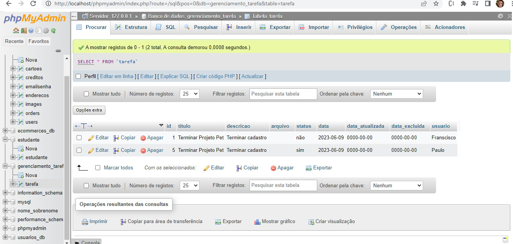

# Projeto desenvolvido

# API Mysql - PHP

Este Projeto é uma API de gerenciamento de tarefa onde é possivel listar, visualizar, criar, editar, excluir .

 

  

  

## Site do Projeto

## Repositorio do Projeto

## Instalação

## BackEnd

Change your mySQL database data `server/app.js`
`$ cd server`
`$ npm install`
`$ npm start`

## BackEnd

- Cria estudante no banco de dados
- Ler estudante no banco de dados
- Atualizar estudante no banco de dados
- Excluir estudante no banco de dados
- Clique no cartão para editar e excluir

## Bibliotecas Usadas

### Back-end

- `express`
- `mysql`
- `nodemon`
- `cors`
